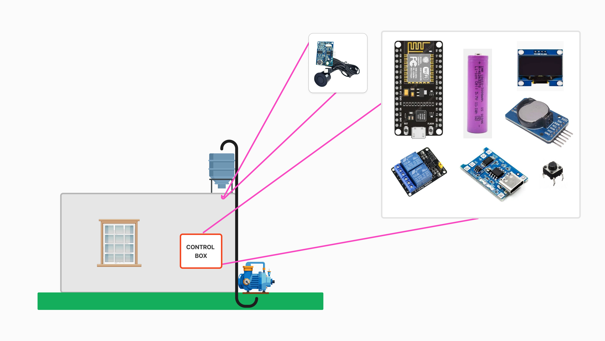

<h1>💧 Fully IoT-Based Water Management System</h1>

<h2>📝 Table of Contents</h2>
<ul>
  <li><a href="#about">About</a></li>
  <li><a href="#system-overview">System Overview</a></li>
  <li><a href="#getting-started">Getting Started</a></li>
  <li><a href="#hardware-components">Hardware Components</a></li>
  <li><a href="#features">Features</a></li>
  <li><a href="#installation">Installation</a></li>
  <li><a href="#usage">Usage</a></li>
  <li><a href="#deployment">Deployment</a></li>
  <li><a href="#testing">Testing</a></li>
  <li><a href="#built-using">Built Using</a></li>
  <li><a href="#acknowledgments">Acknowledgments</a></li>
</ul>

<h2 id="about">🧐 About</h2>

A fully IoT-based water management system designed for buildings to efficiently control water tank levels and water flow. The system automates water pumping, monitors levels, and optimizes usage based on PWD water supply schedules.

<h2 id="system-overview">📊 System Overview</h2>

Key Components:

<ul>
  <li>ESP8266: Main controller for sensor readings and relay control.</li>
  <li>JSN-SR04T Ultrasonic Sensor: Measures water tank levels.</li>
  <li>Dual Channel Relay: Controls the water pump.</li>
  <li>IP5306 BMS/TP4056: Manages battery charging and power switching.</li>
  <li>OLED Display (1.3-inch): Displays tank water levels.</li>
  <li>RTC Module: Keeps track of time for scheduled operations.</li>
  <li>Li-Ion 18650 3.7V 2000mAh Battery: Backup power source.</li>
</ul>

    
    

<h2 id="getting-started">🏁 Getting Started</h2>
<h3>Prerequisites</h3>
<ul>
  <li>ESP8266 development environment (Arduino IDE or PlatformIO).</li>
  <li>Libraries: Wire.h, Adafruit_GFX.h, Adafruit_SSD1306.h, RTClib.h.</li>
</ul>
<h3>Installing</h3>
<ol>
  <li>Clone the repository:
    <pre><code>git clone https://github.com/bhanuj10/IOT-Based-Water-Management-System.git</code></pre>
  </li>
  <li>Install dependencies in Arduino IDE.</li>
  <li>Flash the code to the ESP8266.</li>
</ol>

<h2 id="hardware-components">🛠️ Hardware Components</h2>
All the images of the components are described visually in the component diagram.  
<ul>
  <li>ESP8266</li>
  <li>RTC Module</li>
  <li>Push Button</li>
  <li>JSN-SR04T Ultrasonic Sensor</li>
  <li>Dual Channel Relay</li>
  <li>IP5306 BMS / TP4056</li>
  <li>OLED Display (1.3 inch)</li>
  <li>Li-Ion 18650 3.7V 2000mAh Battery</li>
  <li>10-15m Twisted Pair Wire</li>
  <li>+5V Power Supply</li>

</ul>

<h2 id="features">🚀 Features</h2>
<ul>
  <li>Automatic Water Level Detection every 15 minutes.</li>
  <li>Dual Mode Operation:
    <ul>
      <li>External Power: Full functionality.</li>
      <li>Battery Mode: Deep sleep for power saving.</li>
    </ul>
  </li>
  <li>Smart Pump Control:
    <ul>
      <li>Fill up to 90% when below 50%.</li>
      <li>Fill to 70% if within 30 mins of PWD water supply.</li>
    </ul>
  </li>
  <li>Manual Control via Push Button:
    <ul>
      <li>Single press: Display tank level.</li>
      <li>Long press (3 sec): Force fill mode or turn off pump.</li>
    </ul>
  </li>
  <li>OLED Display: Shows tank levels and system status.</li>
</ul>

<h2 id="installation">⚙️ Installation</h2>
<ol>
  <li>Mount the JSN-SR04T inside the water tank.</li>
  <li>Connect the ESP8266 to all components as per the wiring diagram.</li>
  <li>Power the system using the IP5306 BMS/TP4056.</li>
  <li>Secure the control box housing the ESP8266.</li>
</ol>

<h2 id="usage">🎈 Usage</h2>
<ul>
  <li>The system will automatically manage water levels.</li>
  <li>Use the push button for manual operations.</li>
  <li>OLED will display water levels on specific triggers.</li>
</ul>

<h2 id="deployment">🚀 Deployment</h2>
<ol>
  <li>Place the system in the control box.</li>
  <li>Test all connections and sensor readings.</li>
  <li>Ensure proper Wi-Fi connectivity for IoT functionalities.</li>
</ol>

<h2 id="testing">🔧 Testing</h2>
<h3>End-to-End Tests</h3>
<ul>
  <li>Verify ultrasonic sensor accuracy.</li>
  <li>Test relay control for the water pump.</li>
  <li>Validate OLED display outputs.</li>
</ul>
<h3>Coding Style Tests</h3>
<ul>
  <li>Lint the code using Arduino Lint.</li>
  <li>Follow proper naming conventions and code structure.</li>
</ul>

<h2 id="built-using">⛏️ Built Using</h2>
<ul>
  <li>Arduino IDE - Development Environment</li>
  <li>ESP8266WiFi - Wi-Fi Library</li>
  <li>Adafruit GFX - OLED Display Library</li>
  <li>RTClib - RTC Module Library</li>
</ul>

<h2 id="acknowledgments">🎉 Acknowledgments</h2>
<ul>
  <li>Inspiration from IoT water management systems.</li>
  <li>Special thanks to the open-source community.</li>
</ul>